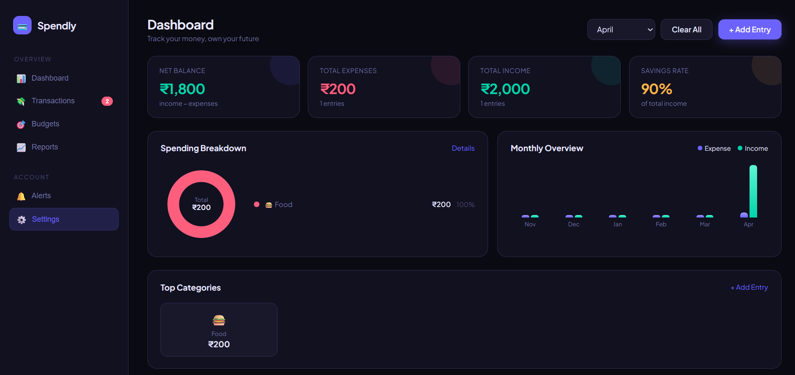
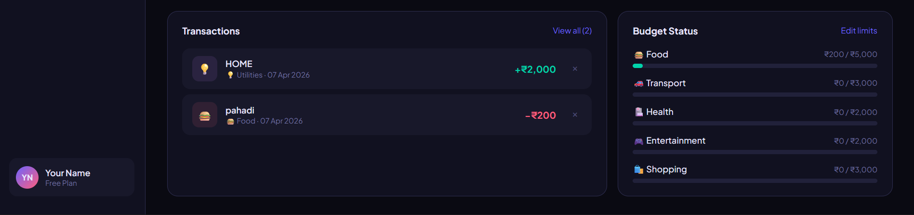

# 💰 Expense Tracker

<p align="center">
  
  
  
  
  
</p>

<p align="center">
  A simple and responsive <b>Expense Tracker Web App</b> built using <b>HTML, CSS, and JavaScript</b>.
</p>

---

## ✨ Overview

This project is an **Expense Tracker Application** that helps users manage their money by tracking:

* 💵 Income
* 💸 Expenses
* 📊 Total Balance

It provides a clean and user-friendly interface where users can add and remove transactions while keeping track of their financial summary.

---

## 🚀 Features

* ➕ Add income and expense transactions
* ❌ Delete transactions
* 💰 Shows total balance
* 📈 Tracks income and expenses separately
* 📱 Responsive design
* 🎨 Clean and modern UI

---

## 🛠️ Tech Stack

* **HTML5** – Structure of the app
* **CSS3** – Styling and responsive design
* **JavaScript** – App functionality and calculations

---

## 📸 Preview

<p align="center">
  
  
</p>

---

## 📂 Project Structure

```bash
expense-tracker/
│── index.html
│── style.css
│── script.js
│── EXPENSE TRACKER PREVIEW 1.png
│── EXPENSE TRACKER PREVIEW 2.png
│── README.md
```

---

## ▶️ How to Run This Project

1. Download or clone this repository
2. Open the project folder
3. Open **`index.html`** in your browser

---

## 💡 What I Learned

While building this project, I learned:

* How to work with **JavaScript arrays and objects**
* How to handle **user input and button events**
* How to update values dynamically using **DOM Manipulation**
* How to calculate **income, expenses, and balance**
* How to create a clean and responsive user interface

---

## 🔮 Future Improvements

* 📅 Add date for each transaction
* 🗂️ Add categories (Food, Travel, Shopping, etc.)
* 💾 Save transactions using local storage
* 📊 Add charts and spending analytics
* 🌙 Add dark/light mode

---

## 👩‍💻 Author

**Neha Yadav**
💻 Frontend Developer | Learning and Building Projects 🚀

---

## 📌 Project Purpose

This project was created as part of my **web development learning journey** to improve my frontend development skills and build practical real-world projects.

---

## ⭐ Support

If you like this project, don’t forget to **star this repository** ⭐

---

<p align="center">
  Made with ❤️ by <b>Neha Yadav</b>
</p>
